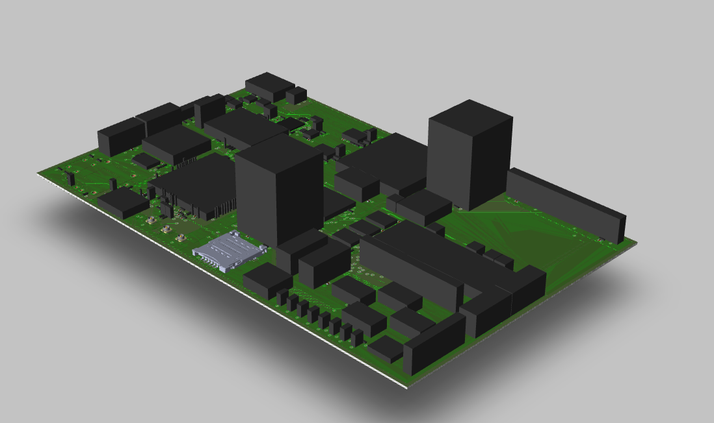
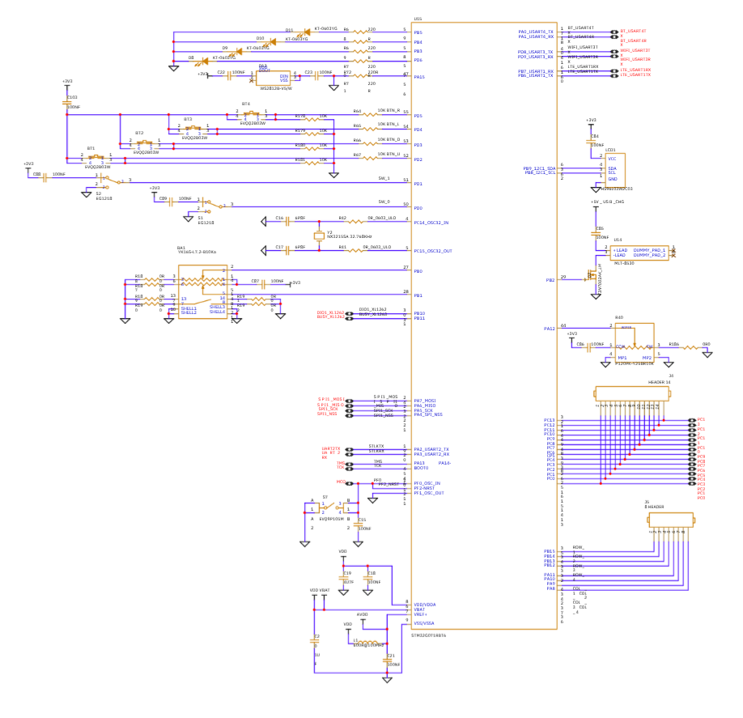
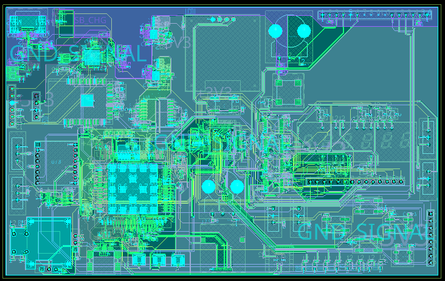
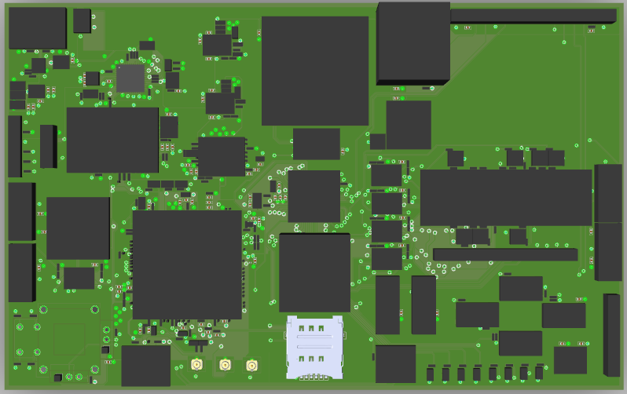
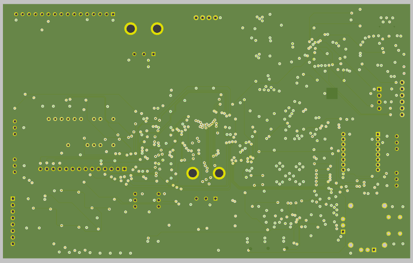

<p align="center">
  
</p>

# Hardware Development Kit - STM32G071RBT6
## Proyecto Final de Electrónica y Diseño Electrónico

**Autor:** Káterin Sagastume  
**Carrera:** Ingeniería en Electrónica y Telecomunicaciones[cite: 1]  
**Institución:** Universidad del Istmo de Guatemala[cite: 1]  
**Fecha:** Mayo de 2026[cite: 1]  

<br>


## **Descripción general**


<br>


<p align="center">
  
</p>

Este repositorio documenta el diseño integral de una tarjeta de desarrollo personalizada (HDK) basada en el microcontrolador **STM32G071RBT6**[cite: 1]. El sistema ha sido concebido para proporcionar una plataforma versátil de prototipado, integrando periféricos esenciales y siguiendo estándares industriales de diseño de hardware.

El flujo de trabajo abarca desde la captura esquemática en **OrCAD Capture**[cite: 1] hasta el diseño físico (layout) en **Allegro PCB Editor**[cite: 1], culminando con la generación de archivos de fabricación y un análisis detallado de costos y materiales.


<br>


## **Tabla de Contenido**


<br>


* [Especificaciones Técnicas](#especificaciones-técnicas)
* [Arquitectura y Esquemático](#arquitectura-y-esquemático)
* [Diseño de PCB y Visualización 3D](#diseño-de-pcb-y-visualización-3d)
* [Documentación de Fabricación](#documentación-de-fabricación)
* [Contenido del Repositorio](#contenido-del-repositorio)
* [Estado actual](#estado-actual)


<br>


## **Especificaciones Técnicas**


<br>


| Característica | Detalle |
| --- | --- |
| **Microcontrolador** | STM32G071RBT6 (ARM Cortex-M0+)[cite: 1] |
| **Frecuencia de Reloj** | Hasta 64 MHz |
| **Voltaje de Operación** | 3.3V DC (Regulación lineal integrada) |
| **Capas de PCB** | 2 Capas (Fr4 - 1.6mm) |
| **Interfaces de Debug** | Conector SWD (Serial Wire Debug) |
| **Protocolos Soportados** | I2C, SPI, UART, GPIO, ADC |


<br>


## **Arquitectura y Esquemático**


<br>


El diseño electrónico se centra en la optimización de recursos y la integridad de señales. Se ha implementado un esquema que garantiza un filtrado de ruido adecuado para el MCU y una distribución de energía eficiente.

<p align="center">
  
</p>
<p align="center"><i>Captura del diagrama esquemático desarrollado en OrCAD Capture</i></p>


<br>


## **Diseño de PCB y Visualización 3D**


<br>


### **Layout y Ruteo**

Se aplicaron restricciones de diseño (DRC) para asegurar la manufacturabilidad. El ruteo prioriza caminos cortos para señales críticas y planos de cobre sólidos para el retorno de tierra.

<p align="center">
  
</p>
<p align="center"><i>Visualización del layout completo en Allegro PCB Editor</i></p>

### **Vistas Tridimensionales**

<p align="center">
  
  
</p>
<p align="center"><i>Renderizado 3D: Cara Superior (Componentes) y Cara Inferior</i></p>


<br>


## **Documentación de Fabricación**


<br>


El proyecto incluye todos los activos necesarios para la producción del hardware:

* **Gerber Files**: Ubicados en la carpeta `Gerbers/`, listos para ser enviados a manufactura industrial.
* **BOM (Bill of Materials)**: Listado detallado de componentes con números de parte y especificaciones en la carpeta `Cotización/`.
* **Análisis de Costos**: Documento de cotización actualizado al 12 de mayo de 2026.


<br>


## **Contenido del Repositorio**


<br>


```text
.
├── Cotización/           # BOM, análisis de costos y archivos de compra
├── Gerbers/              # Archivos .art y .drl para fabricación de PCB
├── IMAGENES/             # Recursos visuales del README
├── KIT_STM32.DSN         # Proyecto esquemático original (OrCAD)
├── kit_stm32.brd         # Archivo de diseño de PCB (Allegro)
├── KIT-STM32_Doc.pdf     # Documentación técnica completa
└── README.md             # Guía principal del proyecto
